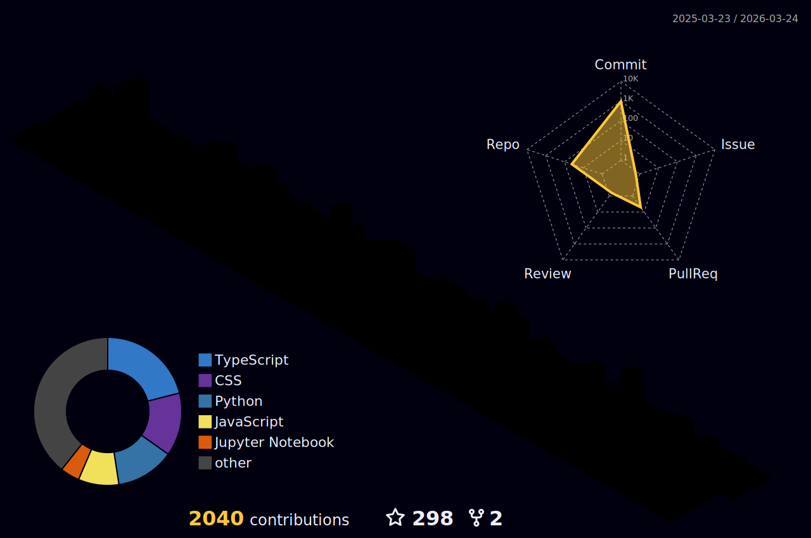

  

---

---

## 🚀 About Me

- 🧑‍🎓 **Computer Engineering Student | India**
- 🏆 **Organizer @ GDGC AIKTC (Google Developer Groups on Campus)**
- 🧠 Passionate about **Web Dev, AI/ML, Android, Cloud & Data Science**
- 🔭 Building **AI-driven apps, websites & real-time dashboards**
- 🌱 Learning **Cloud Computing, LLMs & Distributed Systems**
- 💬 Ask me about **Web Dev, AI/ML, Android, Data Science & Open Source**
- 📫 Email → **amanantuley3794@gmail.com**
- 🤝 Open to **collaborations, internships & innovative projects**

---

# ⚡ GitHub Analytics

<!-- ================= TOP CARDS ================ -->
<table style="border-collapse: collapse;">
<tr>
<td align="center" style="padding: 8px;">

</td>
<td align="center" style="padding: 8px;">

</td>
</tr>
</table>

 

<!-- =============== STREAK + ACTIVITY GRAPH SIDE BY SIDE =============== -->
<table style="border-collapse: collapse;">
<tr>

<td align="center" style="padding: 8px;">

</td>

<td align="center" style="padding: 8px;">

</td>

</tr>
</table>

---

# 🐍 Contribution Snake 

  

---

# 🏆 Achievements

  

# 🧵 3D Contribution Graph

  

---

### GitHub Stats

  
  
  

# 🛠 Tech Stack & Expertise

  

 

---

## 🎨 Frontend Development  

### **Tech Icons**

### **Badges**

  
  
  

---

## ⚙️ Backend Development  

### **Tech Icons**

### **Badges**

  
  
  

---

## 📱 Android Development  

### **Tech Icons**

### **Badges**

  
  
  

---

## 🤖 Artificial Intelligence / Machine Learning  

### **Tech Icons**

### **Badges**

  
  
  

---

## 📊 Data Science  

### **Tech Icons**

### **Badges**

  
  
  
  
  
  

---

## 🗄 Databases  

### **Tech Icons**

### **Badges**

  
  

---

## ☁️ Cloud & DevOps  

### **Tech Icons**

### **Badges**

  
  
  
  

---

## 🧰 Tools & IDEs  

### **Tech Icons**

### **Badges**

  
  
  
  
  
  
  

---

  

# 🚀 Featured Projects

# ✍️ Quote of the Day

  

---

# 🌐 Connect With Me

  
  
  

  

