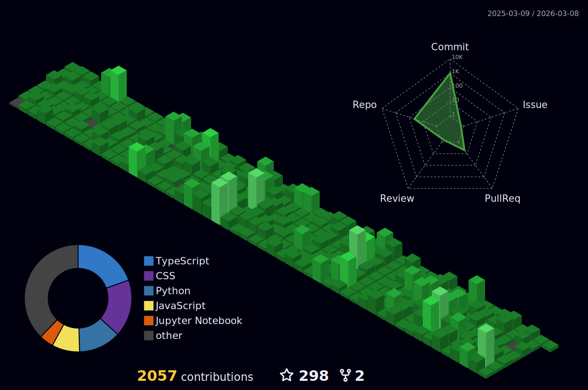

# 🌟 **Aman Antuley — Elevating Code Into Impact**

  

---

## 🚀 **About Me**

* 🧑‍🎓 **Computer Engineering Student | India**
* 🏆 **Organizer @ GDGC AIKTC (Google Developer Groups on Campus)**
* 🧠 Passionate about **Web Dev, AI/ML, Android, Cloud, & Data Science**
* 🔭 Currently working on **AI-powered apps, frontend systems & Android projects**
* 🌱 Learning **Cloud Computing, Data Analytics, Advanced ML, LLMs**
* 💬 Ask me about **Web Dev, AI/ML, Data Science, Open Source, Research**
* 📧 **Reach me at:** `amanantuley3794@gmail.com`
* 💡 Always looking to **collaborate on cutting-edge projects!**

---

# ⚡ **GitHub Insights & Analytics**

<table align="center">
<tr>
<td width="50%" align="center">

### 📊 **GitHub Overview**

  

### 🔥 **Contribution Streaks**

</td>

<td width="50%" align="center">

### 🧠 **Most Used Languages**

  

### 🧩 **Activity Graph**

</td>
</tr>
</table>

---

# 🏆 **Achievements & Trophies**

  

 

  

---

# 🛠 **Tech Stack & Skills**

## 🎯 **Full-Stack Development**

  

## 💻 **Programming Languages**

  

## 🤖 **AI / ML**

  

## 📱 **Android Development**

  

## 📊 **Data Science & Analytics**

  
  
  

## 🌩️ **Cloud & DevOps**

  

## 🎨 **UI/UX & Tools**

  

---

# 🌐 **Connect With Me**

  
  
  

---

# 📈 **Profile Views**

  

---

# 🎉 **Animated Footer**

  

