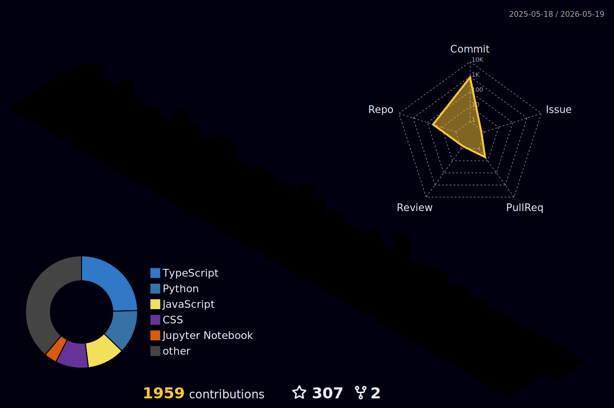

  

  

 

## 🚀 About Me

<table align="center">
  <tr>
    <td width="50%" valign="top">
      <h3>⚡ Professional Snapshot</h3>
      <ul>
        <li>🧑‍🎓 <b>Computer Engineering Student | India</b></li>
        <li>🏆 <b>SIH ’25 Finalist (Smart India Hackathon)</b></li>
        <li>🏆 <b>Organizer @ GDGC AIKTC</b></li>
        <li>🧠 Passionate about <b>Web Dev, AI/ML, Android & Cloud</b></li>
      </ul>
    </td>
    <td width="50%" valign="top">
      <h3>🎯 Current Mission</h3>
      <ul>
        <li>🔭 Building <b>AI-driven apps & real-time dashboards</b></li>
        <li>🌱 Learning <b>Cloud Computing, LLMs & Distributed Systems</b></li>
        <li>💬 Ask me about <b>Web Dev, AI/ML & Open Source</b></li>
        <li>🤝 Open to <b>innovative collaborations & internships</b></li>
      </ul>
    </td>
  </tr>
</table>

# ⚡ GitHub Intelligence & Analytics

  <table style="border-collapse: collapse;">
    <tr>
      <td align="center" style="padding: 5px;">
        
      </td>
      <td align="center" style="padding: 5px;">
        
      </td>
    </tr>
    <tr>
      <td align="center" style="padding: 5px;">
        
      </td>
      <td align="center" style="padding: 5px;">
        
      </td>
    </tr>
  </table>

### 🔝 Top Repositories

  
  

### 🐍 Contribution Ecosystem

  

# 🏆 Excellence & Milestones

  

# 🧵 3D Visualization

  

### 📈 Social Proof Metrics

  
  
  

# 🛠 Tech Stack & Expertise

## 🎨 Frontend Development

  

## ⚙️ Backend Development

  

## 📱 Mobile Development

  

## 🤖 Artificial Intelligence / Machine Learning

  

## 📊 Data Science & Analytics

  

## 🗄 Databases

  

## ☁️ Cloud & DevOps

  

## 🧰 Tools & IDEs

  

---

# ✍️ Daily Inspiration

  

---

# 🌐 Connect With Me

  

