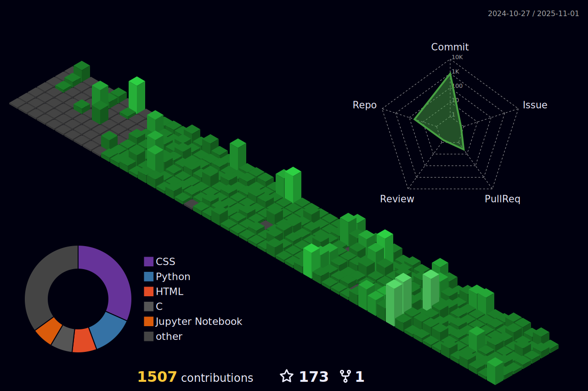

<!-- ===================================================== -->
<!-- 🌟 WORLD'S MOST ADVANCED GITHUB README — AMAN ANTULEY -->
<!-- ===================================================== -->

<h1 align="center">🌟 Aman Antuley — Elevating Code Into Impact</h1>

  

---

  
  
  
  

---

## 🚀 About Me

- 🧑‍🎓 Computer Engineering Student, India  
- 🏆 Organizer @ **GDGC AIKTC**  
- 🤖 Passionate about **AI/ML, Full-Stack Development, Cloud, Android**  
- 🔭 Currently building **AI-driven apps, dashboards & systems**  
- 🌱 Learning **Cloud, LLMs, Distributed Systems, Big Data**  
- 💬 Ask me about **AI, Web Dev, Android, Data Science, Open Source**  
- 📧 Email → `amanantuley3794@gmail.com`  
- 💡 Always open for collaboration & innovative ideas!  

---

# ⚡ GitHub Insights & Analytics

<table align="center">
<tr>
<td width="50%" align="center">

### ⭐ GitHub Overview  

  

### 🔥 Streaks  

</td>
<td width="50%" align="center">

### 🧠 Most Used Languages  

  

### 🧩 Activity Graph  

</td>
</tr>
</table>

---

# 🐍 Auto-Updating GitHub Contribution Snake

  

---

# 🏆 Achievements & Trophies

  

---

# 🧵 3D Contribution Graph (Night Mode)

  

---

# 🛠 Tech Stack Galaxy

---

# 🚀 Featured Projects

### 🌐 PerfectFit — AI Tailored Fashion App  

### 🤖 Finance Tracker + AI  

### ⚙️ NekiHub Admin Dashboard  

---

# 📊 Advanced Developer Metrics

  

---

# 🎵 Spotify — Now Playing

  

---

# ✍️ Dev Quote of the Day

  

---

# 🌐 Connect With Me

  
  
  

---

# 📈 Profile Views

  

---

# 🎉 Animated Wave Footer

  

